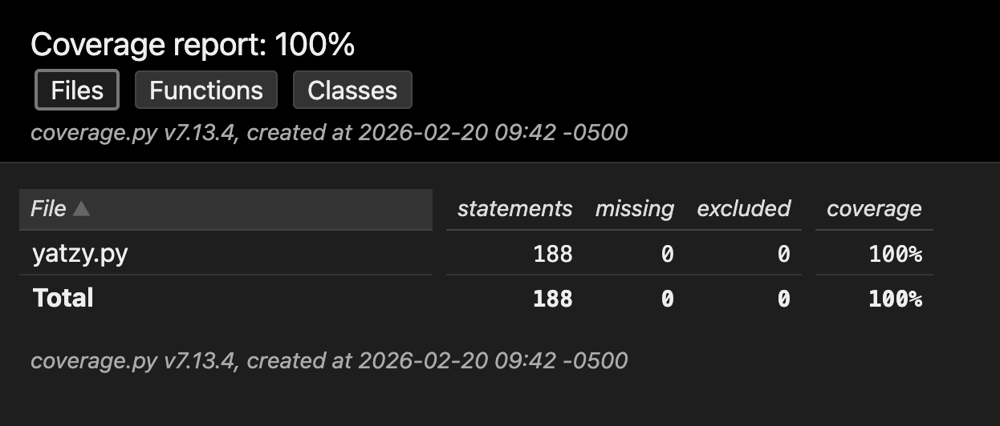
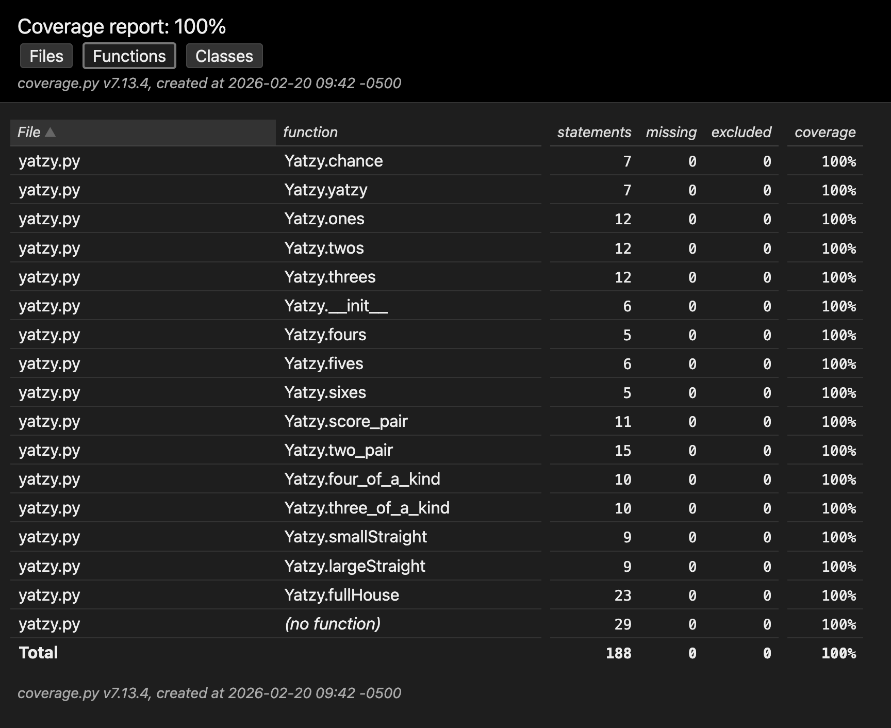
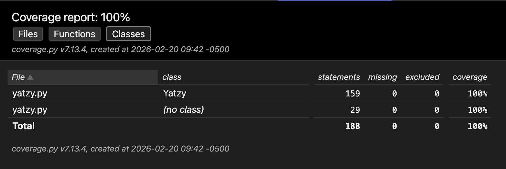

# 🎲 Yatzy — Unit Testing Lab


A unit testing laboratory using the classic **Yatzy** dice game as a case study. The goal is to practice effective unit test design following industry-standard conventions, achieving full code coverage with **pytest** and **pytest-cov**.

---

## 📋 **Table of Contents**

- [Overview](#-overview)
- [Project Structure](#-project-structure)
- [Game Rules](#-game-rules)
- [Unit Tests](#-unit-tests)
- [Coverage Report](#-coverage-report)
- [Getting Started](#-getting-started)
- [Author](#-author)
- [License](#-license)
- [Additional Resources](#-additional-resources)

---

## 🔍 **Overview**

This lab implements **55 unit tests** for a Python implementation of *Yatzy*, covering all 12 scoring categories defined by the official game rules. The test suite follows the **AAA** (*Arrange, Act, Assert*) pattern and is organized using `pytest` class-based structure.

> ⚠️ **Two bugs were discovered** in the original `yatzy.py` during testing: `score_pair()` uses strict equality (`== 2`) when checking die counts, causing it to return `0` when three or four dice show the same value — incorrect per the official rules. These cases are marked as `@pytest.mark.xfail` to document the known defects without hiding them.

---

## 📁 **Project Structure**

```
yatzy-unit-testing/
├── assets/
│   └── images/
│       ├── 01-coverage-report-files.png
│       ├── 02-coverage-report-functions.png
│       └── 03-coverage-report-classes.png
├── yatzy.py          # Source code under test
├── test_yatzy.py     # Unit test suite
├── LICENSE
└── README.md
```

---

## 🎯 **Game Rules**

The *Yatzy* scoring categories and their rules are summarized below:

| Category | Scoring Rule |
|---|---|
| **Chance** | Sum of all 5 dice |
| **Yatzy** | 50 points if all dice are equal, else 0 |
| **Ones – Sixes** | Sum of dice showing that specific number |
| **Pair** | Sum of the two highest matching dice |
| **Two Pairs** | Sum of all four dice forming two distinct pairs |
| **Three of a Kind** | Sum of the three matching dice |
| **Four of a Kind** | Sum of the four matching dice |
| **Small Straight** | 1-2-3-4-5 → scores 15 |
| **Large Straight** | 2-3-4-5-6 → scores 20 |
| **Full House** | Two of a kind + three of a kind → sum of all dice |

---

## 🧪 **Unit Tests**

The test suite in `test_yatzy.py` covers **all 12 scoring methods** of the `Yatzy` class:

- **55 total tests** organized in 12 `pytest` classes (one per scoring category)
- Naming convention: `test_[ClassName]_[should/should_not_validation]`
- Reusable `fixture` and `make_yatzy()` helper to avoid code duplication
- Edge cases covered per category:
  - ✅ Happy path (valid score)
  - ✅ Zero score (no match)
  - ✅ All-dice-equal edge case
  - ✅ Category-specific boundary rules (e.g., four-of-a-kind inside pair scoring)
- 2 tests marked `xfail` for known bugs in production code

**Run the tests:**

```bash
pytest test_yatzy.py -v
```

---

## 📊 **Coverage Report**

Coverage was measured using **`pytest-cov`** with `coverage.py v7.13.4`. The suite achieves <u>**100% statement coverage**</u> across all 188 statements in `yatzy.py`.

**Generate the HTML report:**

```bash
pytest test_yatzy.py --cov=yatzy --cov-report=html --cov-fail-under=85
```

### 🗂️ Files View



### ⚙️ Functions View



### 🏛️ Classes View



The coverage formula achieved:

$$\text{Coverage} = \frac{\text{Statements Executed}}{\text{Total Statements}} \times 100 = \frac{188}{188} \times 100 = 100\%$$

---

## 🚀 **Getting Started**

**Prerequisites:** Python 3.12+

```bash
# Install dependencies
pip install pytest pytest-cov

# Run tests with coverage
pytest test_yatzy.py --cov=yatzy --cov-report=html

# Open the HTML report
open htmlcov/index.html
```

---

## 👥 **Author**

<table>
  <tr>
    <td align="center">
      <a href="https://github.com/JAPV-X2612">
        
        <br />
        <sub><b>Jesús Alfonso Pinzón Vega</b></sub>
      </a>
      <br />
      <sub>Full Stack Developer</sub>
    </td>
  </tr>
</table>

---

## 📄 **License**

This project is licensed under the **Apache License, Version 2.0**. See the [LICENSE](LICENSE) file for details.

---

## 🔗 **Additional Resources**

- [Yatzy Kata Description — Samman Coaching](https://sammancoaching.org/kata_descriptions/yatzy.html)
- [pytest Documentation](https://docs.pytest.org/en/stable/)
- [pytest-cov Documentation](https://pytest-cov.readthedocs.io/en/latest/)
- [Coverage.py Documentation](https://coverage.readthedocs.io/en/latest/)
- [AAA Pattern — Arrange, Act, Assert](https://automationpanda.com/2020/07/07/arrange-act-assert-a-pattern-for-writing-good-tests/)
- [Emily Bache — Refactoring Katas](https://github.com/emilybache)